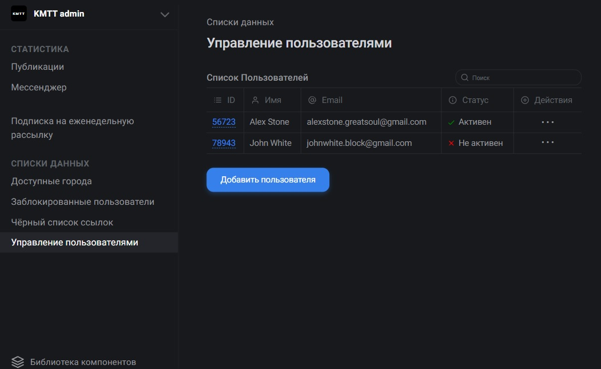

# [KMTT Admin](https://agants.github.io/kmtt/)
Приложение-фреймворк для создания административных страниц.



## Функционал:
* Приложение представляет из себя общий лэйаут админки + набор компонентов, из которых можно собирать страницы
* Содержание меню и содержание страниц задаётся конфигом
* Приложение адаптированно под мобильные устройства
* Методы, аргументы, свойства, переменные, возвращаемые значения, типы и основные логические моменты продокументированы в формате jsdoc
* Настроена проверка синтаксиса с помощью ESlint
* Для сборки используется Webpack

### Project setup
```
npm install
```

#### Compiles and hot-reloads for development
```
npm run serve
```

#### Lints and fixes files

```
npm run eslint
```